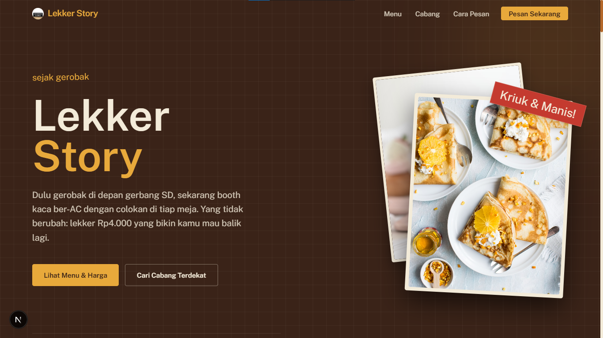

# Lekker Story 🥞

Kue lekker bukan kaleng-kaleng. Dari gerobak pinggir SD sampai cafe ber-AC, sejak 2014. 
Website *company profile* resmi untuk jaringan waralaba Lekker Story.

  

## 🌟 Fitur Utama
- **Modern & Cepat**: Dibangun dengan Next.js App Router terbaru sebagai *static export*.
- **Desain Premium**: Pendekatan desain *anti-slop* yang menggunakan layout asimetris, efek *glassmorphism*, susunan polaroid bertumpuk, dan transisi mulus.
- **Responsif Penuh**: Tampil sempurna di perangkat mobile maupun desktop.
- **Tanpa Backend**: *Fully static website*, siap di-host di Vercel, Netlify, atau GitHub Pages.

## 🚀 Cara Menjalankan (Development)

Pastikan kamu sudah menginstal Node.js versi terbaru.

1. Install *dependencies*:
   `ash
   npm install
   `
2. Jalankan *development server*:
   `ash
   npm run dev
   `
3. Buka [http://localhost:3000](http://localhost:3000) di browsermu!

## 📦 Build untuk Production

Proyek ini dikonfigurasi untuk menghasilkan *static export* (kumpulan file HTML/CSS/JS statis) di dalam folder out/.

`ash
npm run build
`

## 🎨 Teknologi yang Digunakan
- **Next.js** (App Router)
- **Tailwind CSS** (Styling)
- **Lucide React** (Ikon)
- **Geist & Google Fonts** (Tipografi)